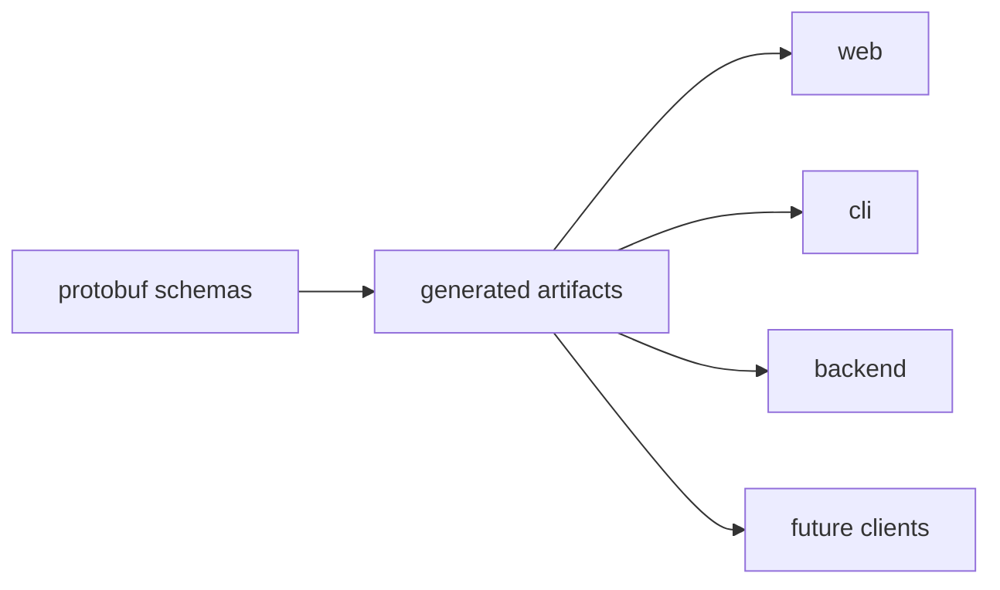
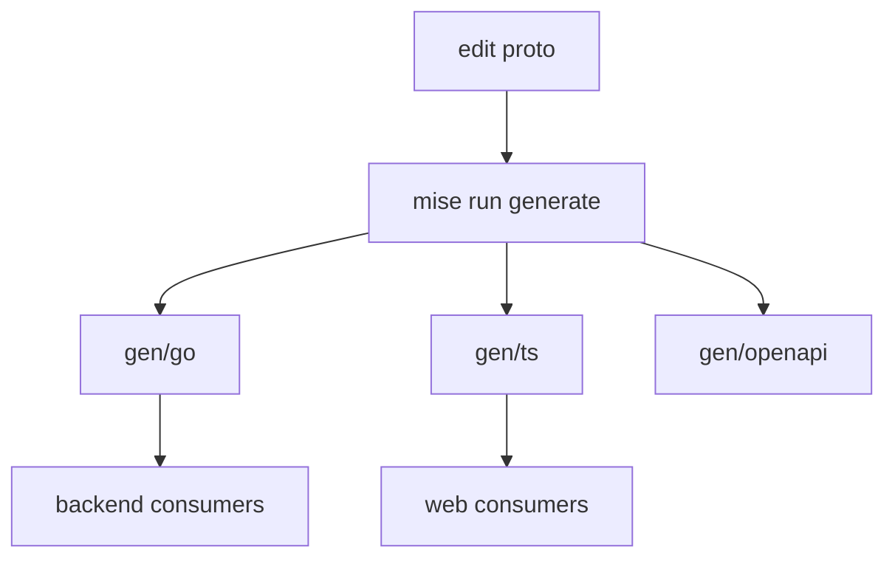

# Architecture

This document describes how `chill-contracts` is built.

## System Context

## Components

| Component | Responsibility | Talks to |
|-----------|----------------|----------|
| `proto/` | Canonical public API schemas | Buf, generators |
| `gen/go/` | Generated Go contract types | backend consumers |
| `gen/ts/` | Generated TypeScript contract types | `web`, future JS clients |
| `gen/openapi/` | Generated OpenAPI output | docs and tooling |
| `testdata/consumers/` | Tiny downstream fixtures proving Go and TypeScript consumers still compile/import | generated artifacts, `mise` |
| package metadata | Publish the TypeScript package and release artifacts | npm, GitHub releases |

## Generation Model

## Boundaries

- This repo owns public contracts only.
- Backend behavior, web UX, and CLI command surfaces do not live here.
- Compatibility decisions here are consumer-facing and should be treated like API changes.

## Release Model

- `main` is the release branch.
- `Verify` runs on pull requests.
- `Main` runs on pushes to `main`.
- verification includes tiny downstream consumer checks for Go and TypeScript fixtures under `testdata/consumers/`
- `Main` re-verifies the repo and then publishes the npm package and GitHub release from `main`
- `Publish Package` remains available as a manual fallback for the publish path
